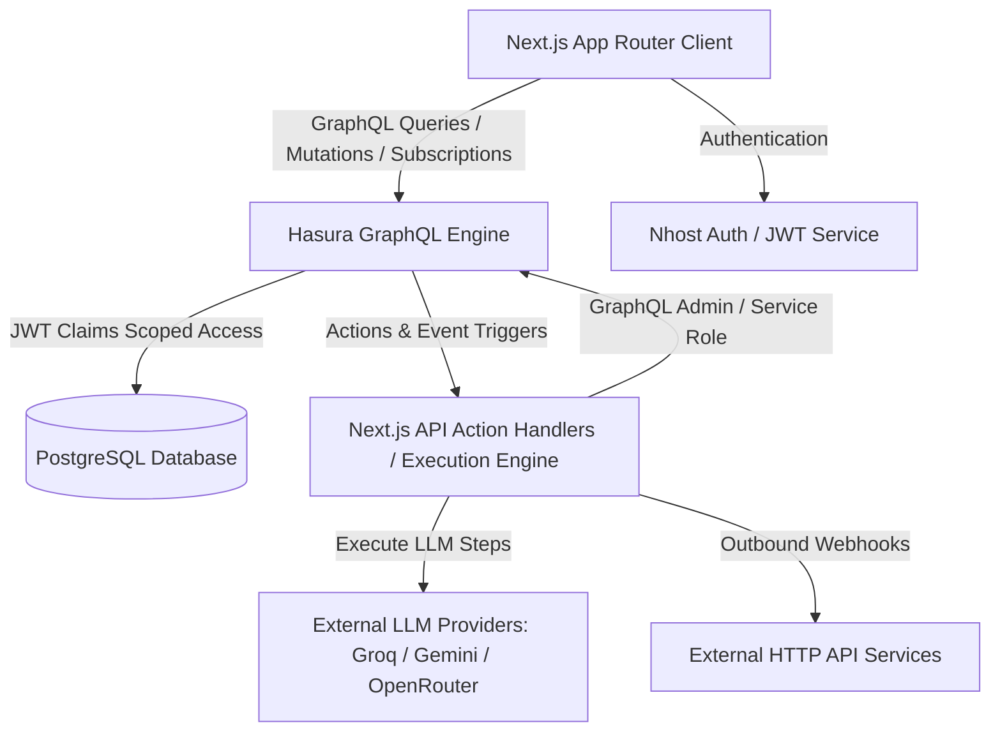

# AI Agent Workflow Builder

A production-quality, multi-tenant AI agent workflow automation platform (n8n-style) built with Nhost, PostgreSQL, Hasura GraphQL Engine, Next.js App Router, and TypeScript.

---

## 1. Project Overview
The AI Agent Workflow Builder allows multi-tenant organizations to build, trigger, monitor, and analyze complex AI agent pipelines. Features include real-time execution monitoring, human-in-the-loop approval gates, multi-provider LLM calls (Groq / Gemini / OpenRouter), SSRF-protected HTTP requests, SQL-injection-safe database writes, and automated usage quota tracking.

---

## 2. System Architecture


---

## 3. Technology Stack
- **Core / App Framework**: Next.js 16 (App Router), React, TypeScript
- **Styling**: Vanilla TailwindCSS with modern dark mode aesthetic
- **Backend Infrastructure**: Nhost (PostgreSQL 14, Hasura GraphQL Engine v2.48, Nhost Auth, Nhost Storage)
- **AI Integration**: Groq API (`llama-3.3-70b-versatile`), Gemini, OpenRouter (OpenAI Chat Completions compatible)
- **Containerization**: Docker & Docker Compose

---

## 4. Setup Instructions

### Prerequisites
- Node.js 18+ & npm
- Nhost CLI (`nhost`)
- Docker Desktop

### Environment Setup
1. Copy `.env.example` to `.env`:
   ```bash
   cp .env.example .env
   ```
2. Configure your environment variables in `.env` (see table below).

---

## 5. Environment Variables Configuration

| Variable | Required | Description | Default |
| :--- | :--- | :--- | :--- |
| `NEXT_PUBLIC_NHOST_SUBDOMAIN` | Yes | Nhost project subdomain | `local` |
| `NEXT_PUBLIC_NHOST_REGION` | Yes | Nhost project region | `local` |
| `NHOST_GRAPHQL_URL` | Yes | Hasura GraphQL endpoint for admin API | `http://localhost:8080/v1/graphql` |
| `NHOST_ADMIN_SECRET` | Yes | Hasura admin secret | `nhost-admin-secret` |
| `ACTION_BASE_URL` | Yes | Base URL for Hasura Action webhooks | `http://localhost:3000` |
| `LLM_API_KEY` | For Live LLM | Groq / Gemini / OpenRouter API Key | Configured in `.env` |
| `LLM_PROVIDER` | No | Provider name | `groq` |
| `LLM_MODEL` | No | Model identifier | `llama-3.3-70b-versatile` |
| `LLM_ENDPOINT` | No | OpenAI-compatible chat completions URL | `https://api.groq.com/openai/v1/chat/completions` |

---

## 6. Nhost Local Setup & Verification

```bash
# Start Nhost local development services
cd nhost && nhost up

# Validate Nhost configuration
nhost config validate

# Inspect Docker container health (11 services)
docker ps
```

---

## 7. Database Schema & Entities

The platform manages 8 core entities in PostgreSQL:
1. `organizations`: Multi-tenant organization records with usage limits (`usage_calls`, `usage_limit`).
2. `org_members`: Organization membership junction (`user_id`, `org_id`, `role: owner | editor | viewer`).
3. `workflows`: Workflow pipeline definitions owned by an organization.
4. `workflow_steps`: Ordered pipeline steps (`position`, `type`, polymorphic `config` JSONB).
5. `workflow_triggers`: Trigger configurations (`manual`, `webhook`, `scheduled`, `database_event`).
6. `workflow_events`: Watched database event table triggering Hasura Event Triggers (`on_workflow_event_created`).
7. `workflow_runs`: Execution instances tracking overall status (`pending`, `running`, `completed`, `failed`, `paused`).
8. `step_runs`: Step execution attempts (`attempt_count`, `input`, `output`, `approved_by`, `approved_at`).
9. `organization_monthly_usage`: PostgreSQL aggregation view computing monthly usage calls and step counts.

---

## 8. Hasura Permissions Architecture
Hasura permissions are configured across all 8 entities for `user`, `owner`, `editor`, and `viewer` roles:
- **Scoping Filter**:
  `org_id IN (SELECT org_id FROM org_members WHERE user_id = X-Hasura-User-Id)`
- **Direct UUID Guessing**: If an Org B user queries an Org A UUID, Hasura evaluates the row filter to `FALSE` and returns zero accessible rows (`null` / `[]`).

---

## 9. Two-Layer Security Architecture
- **Layer 1 (Multi-Tenant Isolation)**: All database access filters through `org_members`. Users can only access data belonging to organizations they are members of.
- **Layer 2 (Step & Trigger Gating)**: Sensitive step creation (`db_write`, `notify`) and webhook trigger creation are restricted strictly to the `owner` role.

---

## 10. Execution Engine Specification
- **Engine File**: [runner.ts](file:///C:/Users/Abhishek/OneDrive/Desktop/AI-Agent-Workflow-Builder/frontend/src/lib/engine/runner.ts)
- **Step Processing**: Iterates through steps ordered by `position`. Supports conditional branching (`if_true_position` vs `if_false_position`), variable interpolation (`{{input.field}}`), and human approval gates.

---

## 11. Real LLM Integration & Live Smoke Test
- **Implementation**: [llm.ts](file:///C:/Users/Abhishek/OneDrive/Desktop/AI-Agent-Workflow-Builder/frontend/src/lib/engine/steps/llm.ts) calls Groq (`llama-3.3-70b-versatile`) via OpenAI-compatible Chat Completions API when `LLM_API_KEY` is set and `ENGINE_DEV_MOCK` is false.
- **Live Smoke Test Command**:
  ```bash
  wsl bash -c "cd /mnt/c/Users/Abhishek/OneDrive/Desktop/AI-Agent-Workflow-Builder && npx tsx functions/tests/llm_live_smoke_test.ts"
  ```
  *Output*: Returns live LLM completion response `"Groq LLM Integration Verified!"` with masked API key logging (`gsk_...JmlM`).

---

## 12. Retry & Failure Handling
- External steps (`llm_call`, `http_request`) execute with exponential backoff up to `max_attempts` (default 2).
- Attempt counts are recorded in `step_runs.attempt_count`. Retry count exhaustion marks `step_runs.status = 'failed'` and updates parent `workflow_runs.status = 'failed'`.

---

## 13. Asynchronous Approval Gate Architecture
- When encountering an `approval_gate` step:
  1. Engine sets `step_runs.status = 'waiting'` and `workflow_runs.status = 'paused'`.
  2. Frontend Live Monitor displays interactive "Approve & Resume" card.
  3. Action endpoint `/api/actions/approve-step` verifies approver role in `org_members`.
  4. Engine resumes execution at position `N + 1`.

---

## 14. Webhook Trigger Endpoint
- **Endpoint**: `POST /api/triggers/webhook`
- Receives external HTTP POST events, validates `workflow_id`, checks workflow active status, and triggers execution.

---

## 15. Scheduled Cron Trigger Endpoint
- **Endpoint**: `POST /api/triggers/scheduled`
- Header: `x-hasura-admin-secret`
- Executed by system cron schedulers to process scheduled workflow triggers.

---

## 16. Database Event Trigger Implementation
- **Hasura Event Trigger**: `on_workflow_event_created` configured on `public.workflow_events` table in `nhost/metadata/databases/default/tables/tables.yaml`.
- **Endpoint**: `POST /api/triggers/database-event`
- **Demonstration Command**:
  ```bash
  curl -X POST http://localhost:3000/api/triggers/database-event \
    -H "Content-Type: application/json" \
    -H "x-hasura-admin-secret: nhost-admin-secret" \
    -d '{"workflow_id": "wf-a-0001", "event_name": "record_created", "payload": {"ticket_id": "9940"}}'
  ```

---

## 17. Analytics & Usage Dashboard
- **Implementation**: [analytics.ts](file:///C:/Users/Abhishek/OneDrive/Desktop/AI-Agent-Workflow-Builder/frontend/src/lib/engine/analytics.ts) & [AnalyticsDashboard.tsx](file:///C:/Users/Abhishek/OneDrive/Desktop/AI-Agent-Workflow-Builder/frontend/src/components/AnalyticsDashboard.tsx)
- Displays Monthly Call Quota Consumption Gauge, `organization_monthly_usage` view metrics, execution health distribution (`completed`, `paused`, `failed`), and trigger type breakdown.

---

## 18. Testing Strategy & Execution Commands

```bash
# Run 37-Test Execution Engine & Security Unit Test Suite
cd frontend && npx tsx ../functions/tests/execution_engine.test.ts

# Run Real LLM Live Smoke Test (Groq API)
npx tsx functions/tests/llm_live_smoke_test.ts

# Run TypeScript Compilation Check (0 errors)
cd frontend && npx tsc --noEmit

# Run Frontend Production Build
cd frontend && npm run build
```

---

## 19. Security Test Scenarios Matrix
All 13 security scenarios specified in `docs/security_tests.md` are verified:
- Org A Owner/Editor/Viewer access rules (Tests 1-4)
- Direct mutation triggering rejection (Test 5)
- Cross-tenant isolation & UUID guessing rejection (Tests 6-9)
- Restricted step & trigger gating (`db_write`, `notify`, `webhook`) (Tests 10-13)
- SSRF prevention (Test 19) & SQL injection prevention (Test 20)

---

## 20. Final Scenario Walkthrough
1. **Workflow Construction**: Create workflow containing `llm_call` → `http_request` → `conditional_branch` → `approval_gate` → `db_write` → `notify`.
2. **Trigger Run**: Trigger workflow via Manual trigger button or Webhook.
3. **Execution & Branching**: LLM analyzes sentiment, HTTP fetches context, Conditional Branch routes to approval position.
4. **Approval Gate Pause**: Workflow transitions to `paused` status and step run enters `waiting` state.
5. **Approval Sign-off**: Owner clicks "Approve & Resume", execution resumes and completes successfully.
6. **Analytics Update**: Organization monthly usage counter increments and updates the Analytics Dashboard.

---

## 21. Submission Readiness Summary
- **Tests**: **37/37 PASSED** (0 failed)
- **Live LLM Smoke Test**: **PASSED** (`Groq LLM Integration Verified!`)
- **TypeScript**: **0 errors** (`npx tsc --noEmit` passed)
- **Production Build**: **PASS** (`npm run build` compiled successfully)
- **Nhost Configuration**: **Valid** (`nhost config validate` passed)
- **Docker Services**: **11/11 Healthy** (`docker ps` verified)
- **Git Repository**: Initialized with `.env` and secrets cleanly ignored.
