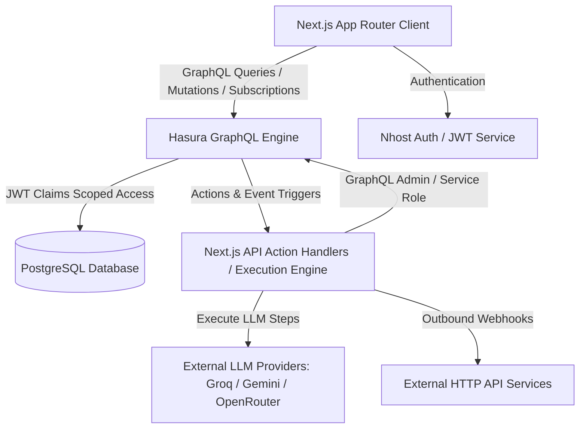
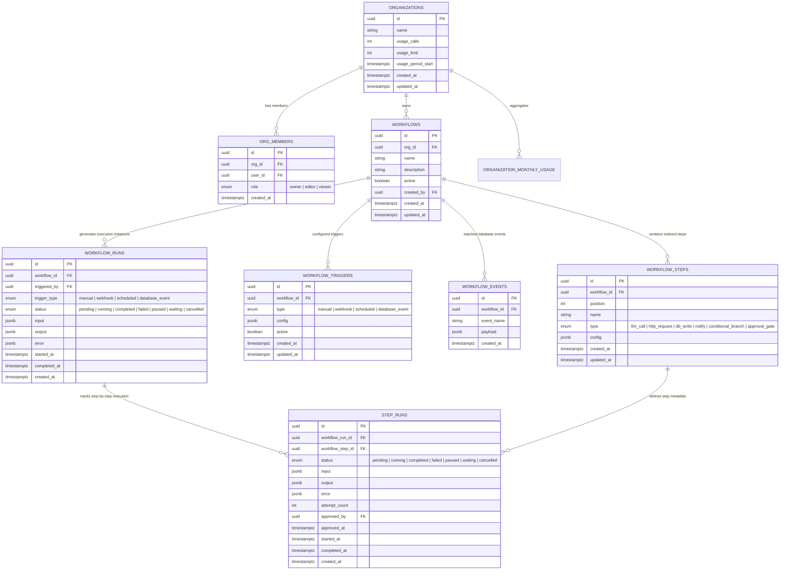

# Architecture Specification & Technical Write-Up: AI Agent Workflow Builder

## 1. System Architecture Overview

The system is a production-grade, multi-tenant AI agent workflow automation platform built on Nhost, PostgreSQL, Hasura GraphQL Engine, Next.js, and serverless execution functions.

---

## 2. Database Entity Relationship Diagram & Schema Reasoning

### Rationale for Separating `workflow_runs` and `step_runs`:
1. **State Isolation**: Parent execution state (`running`, `paused`, `completed`, `failed`) can be monitored independently of granular step execution state.
2. **Granular Retries & Re-execution**: When an external step (e.g. LLM rate limit or HTTP timeout) fails, only that step's `step_run` is retried with incremented `attempt_count`, preserving prior step outputs.
3. **Real-time Live Subscriptions**: Frontend live GraphQL subscriptions stream step-by-step execution progress visually without re-fetching full parent workflow metadata.

---

## 3. Two-Layer Security Architecture & Authorization Rationale

### Layer 1: Multi-Tenant Organization & Role Scoping
- Every Hasura permission rule filters through the `org_members` junction table:
  `org_id IN (SELECT org_id FROM org_members WHERE user_id = X-Hasura-User-Id)`
- **UUID Guessing Prevention**: If an Org B user attempts to query or trigger an Org A workflow by supplying its exact UUID, Hasura returns zero accessible rows (`null` / `[]`), rendering Org A resources invisible.

### Layer 2: Step-Level & Trigger Gating
- Sensitive step types (`db_write`, `notify`) and trigger types (`webhook`) can **only** be added, updated, or deleted by users with the `owner` role within that specific organization.
- Non-owner members attempting to inject restricted steps receive immediate `permission_denied` errors.

### Why Approval Authorization Must Be Enforced Server-Side (Action / Backend):
Frontend UI role checks alone are insufficient because malicious clients can bypass browser UI controls and invoke GraphQL mutations or HTTP Action endpoints directly.
- On every approval request (`/api/actions/approve-step`), the backend handler queries `org_members` using Hasura admin credentials, verifies that the requesting `X-Hasura-User-Id` belongs to the workflow's organization, and validates that their role meets the `required_role` (e.g. `owner`). Direct API tampering is cleanly rejected.

---

## 4. Execution Engine Lifecycle, Pause/Resume & Subscriptions

1. **Trigger Initiation**: A workflow run is initiated via `manual`, `webhook`, `scheduled`, or `database_event` trigger.
2. **Pre-Execution Quota Check**: The engine checks `organization.usage_calls < organization.usage_limit`. If exhausted, execution is blocked with `Quota exhausted`.
3. **Sequential Step Loop**: Steps execute sequentially by position:
   - **`llm_call`**: Interpolates input variables, calls real Groq / Gemini / OpenRouter provider (or dev stub when `ENGINE_DEV_MOCK=true`).
   - **`http_request`**: Validates URL protocol (`http:`, `https:`) to block SSRF, executes HTTP request, sanitizes authorization headers.
   - **`conditional_branch`**: Evaluates expression against context data and sets target step position (`if_true_position` or `if_false_position`).
   - **`approval_gate`**: Sets `step_runs.status = 'waiting'` and `workflow_runs.status = 'paused'`, firing a notification event and halting the execution loop.
4. **Human-in-the-Loop Resume**: When an authorized reviewer approves the step via `/api/actions/approve-step`, `step_runs.approved_by` and `approved_at` are populated, `step_runs.status` transitions to `completed`, and the engine resumes execution at position `N + 1`.
5. **Live GraphQL Subscriptions**: Real-time progress is observed via Hasura GraphQL subscription on `step_runs(where: { workflow_run_id: { _eq: $runId } })`.

---

## 5. Quota Enforcement & Retry Handling

- **Quota Tracking**: `organization.usage_calls` is checked pre-execution and incremented upon successful workflow run completion. Monthly aggregates are exposed via `organization_monthly_usage` view.
- **Retry Mechanics**: External steps (`llm_call`, `http_request`) execute with exponential backoff up to `max_attempts` (default 2). Attempt counts are recorded in `step_runs.attempt_count`. Failure after retry exhaustion marks `step_runs.status = 'failed'` and sets parent `workflow_runs.status = 'failed'`.
